# ConvNet-in-Numpy
Convolutional Neural Network implemented in PURE numpy.

The __init__.py contains the network, training, and testing.
The layer.py contains the helper functions that make the network much more readable, and shorter

**Initialization of parameters**

Initialization was using np.random.randn(), and to prevent initial explosive gradients and output, I had divided by the sqrt of the size for a single filter, and for the fully connected layer, divide by the sqrt of the previous layer's size. For instance, I had divided the filters by 25, divided the first fully connected weights by 18 (since the size was 320), and the second set of weights by 10.

**Architecture of the model**

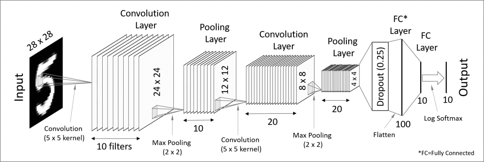

This is picture depicting the model is the exact same as mine, only that I put dropout on the first two fully connected layers, instead of just the flattened layer.

**Here is an example of what the input image (with dimention 10, since there are 10 filters for the first convolutional layer) might look like after the first convolution**

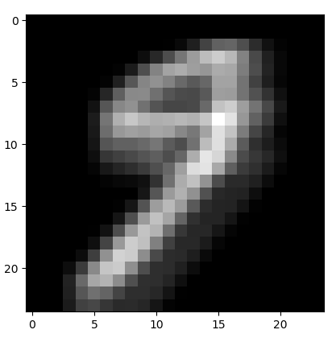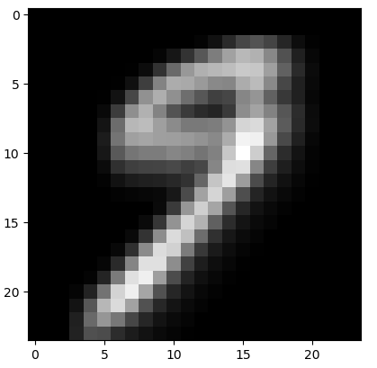

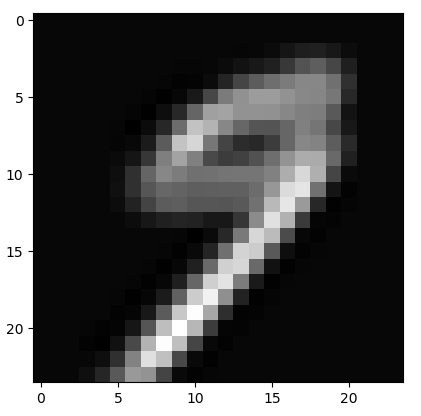
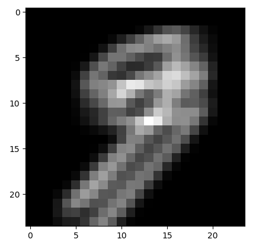
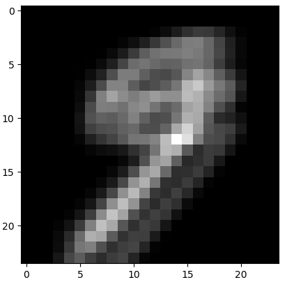
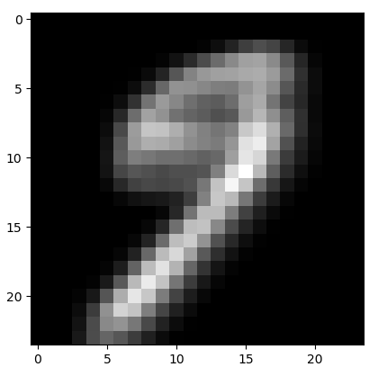
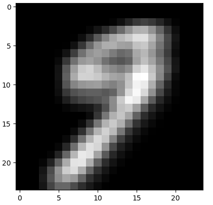
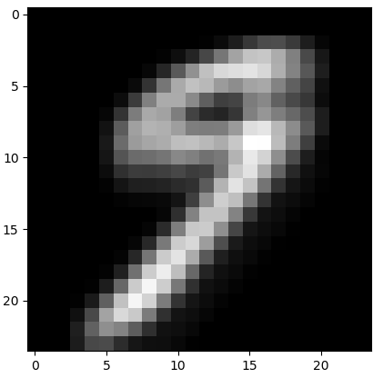
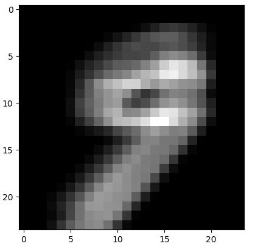

**Here are all of the first set of filters shown in gray scale images**

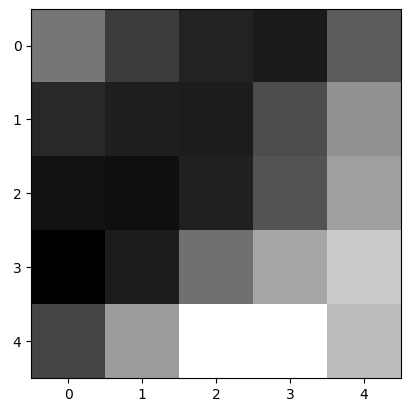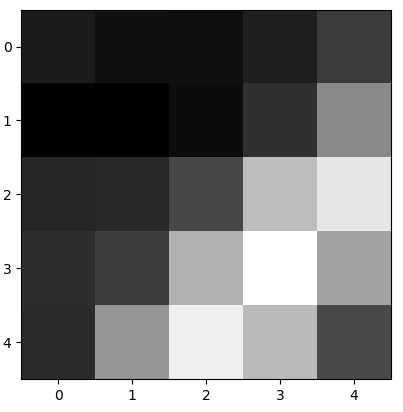
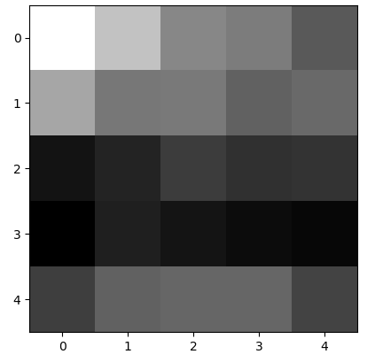
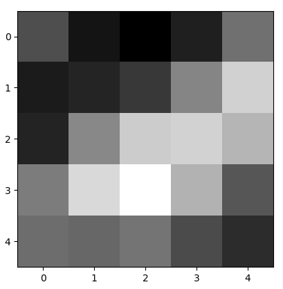
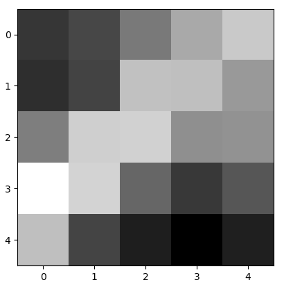
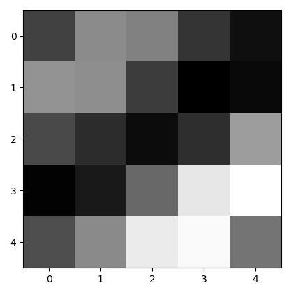

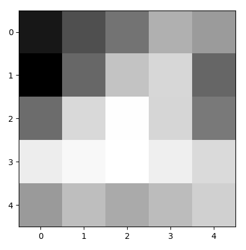
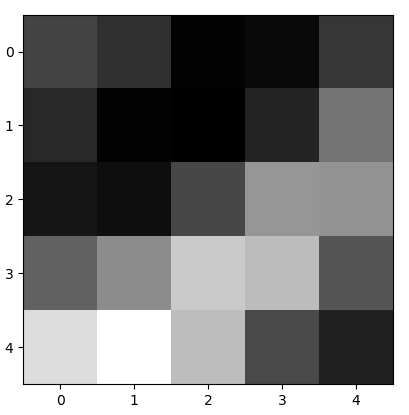
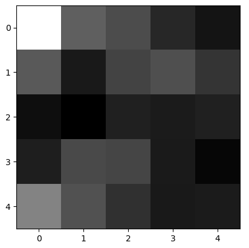

By intuition, we should expect these filters to detect primitive features of images, such as edges, lines, and corners, and we can sort of see this detection in these images.

**Here are 10 of the second set of filters shown in gray scale images**

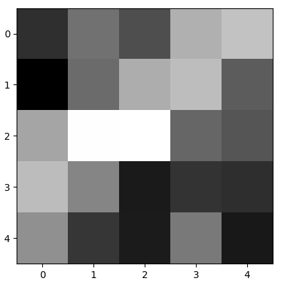
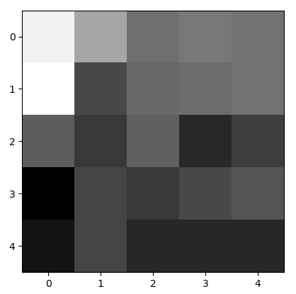
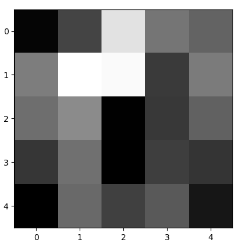
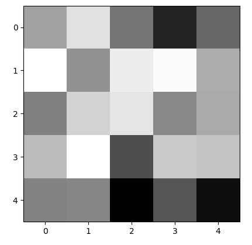
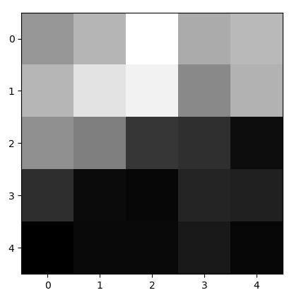
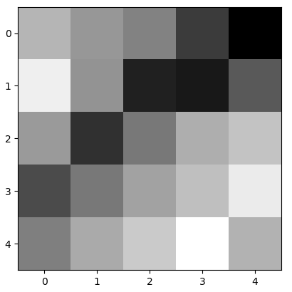
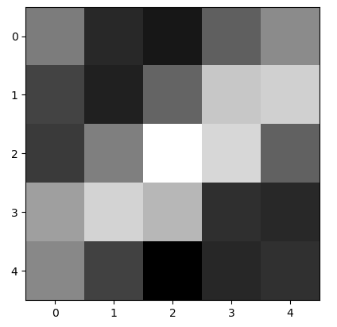
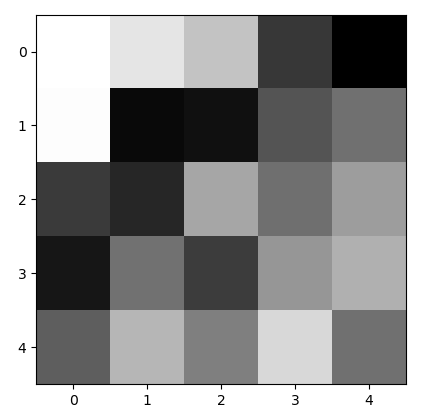
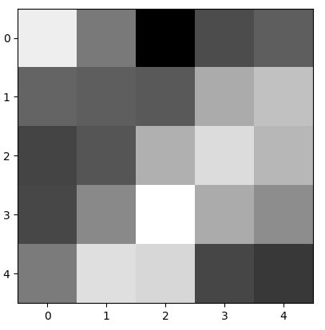

Also by intuition, we should expect these filters to detect more abstract features, such as a circle as being part of an 8 or a 9, or the curviness from some numbers such as a 6. You can see that these filters detect more than such primitive shapes from the first convolutional layer.

**Here shows the progression of the Convolutional Neural Network**

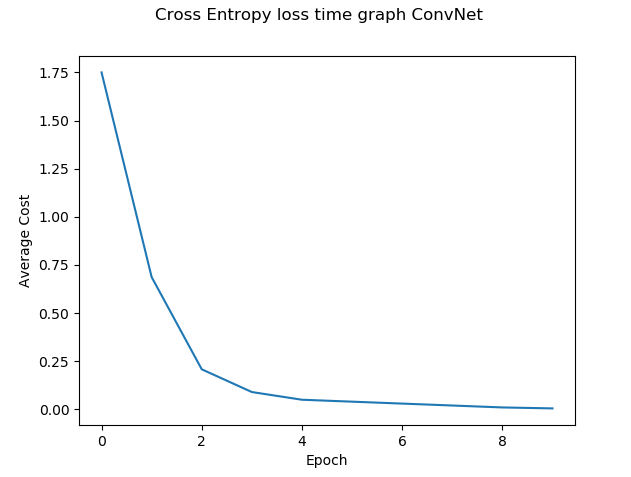

This graph only shows the change in the first training set, which is why you only see maximum epoch of 10 because I had decided to run each training set 10 times before moving onto the next.

Just as a side note, this model was trained over many instances, rather than just the first 1000 samples. It was also training from the second, third, fourth, and fifth 1000 samples, passing each training set 10 times before moving onto the next training set. What you see here is just the first 1000.

After fully completing the training, this model achieved an accuracy of 96.6% from testing
